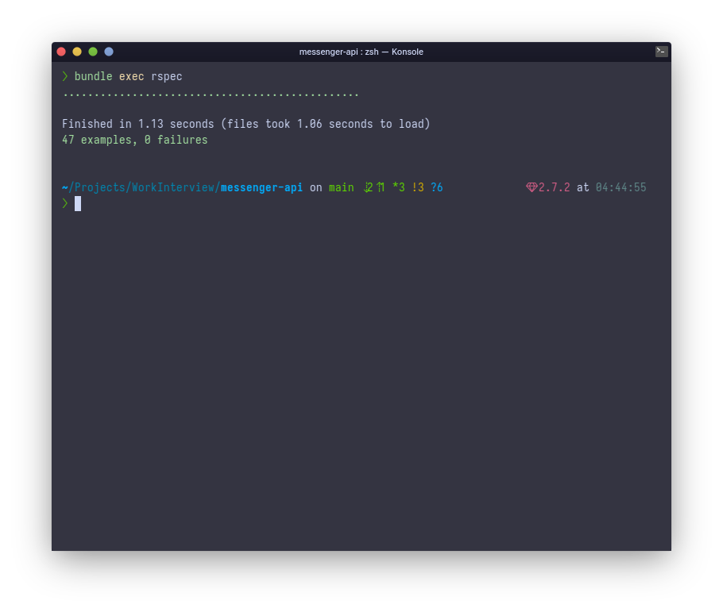

# README

The challenge is make sure when you run `bundle exec rspec`, all result is green (without error):) 

## Version
* Rails v6.1.7
* Ruby v2.7.2
* Database postgreSQL
* Bundle v2.1.4

### Test Result

